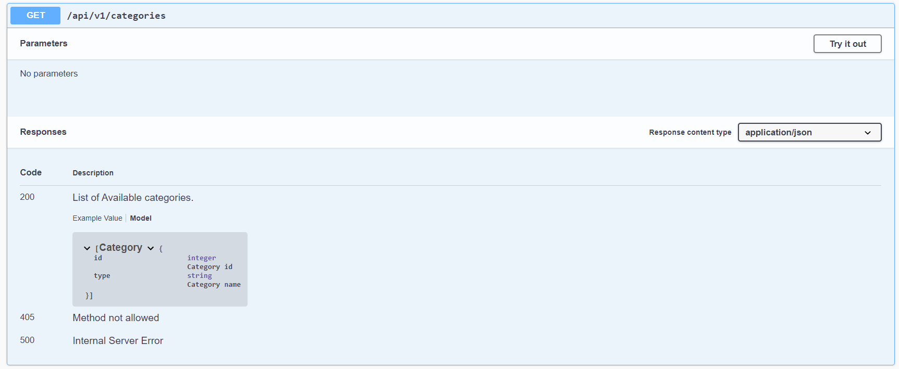
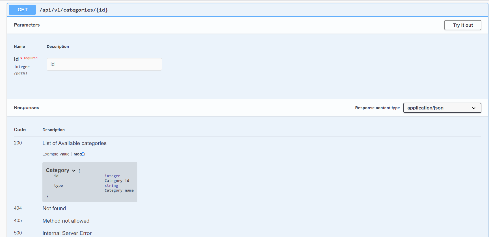
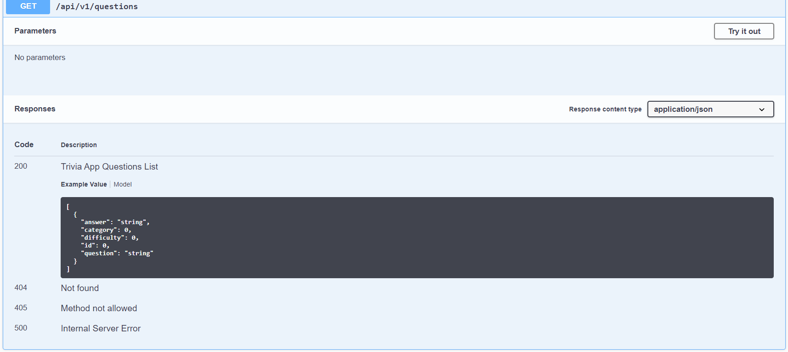
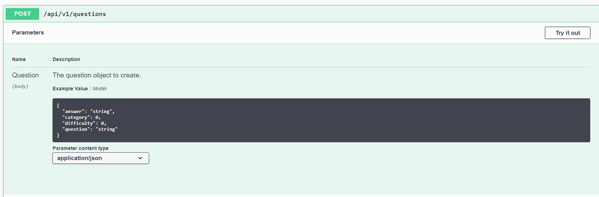
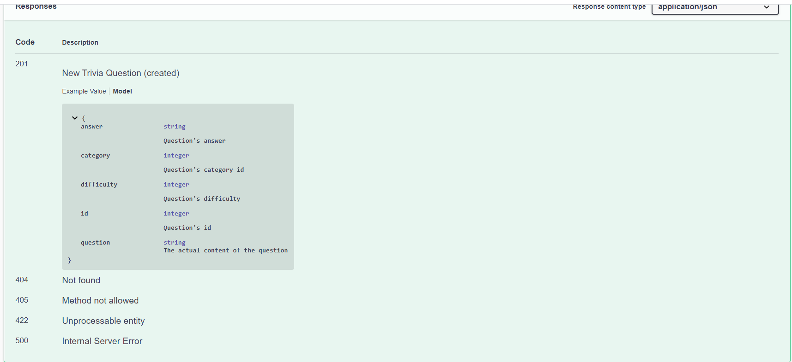
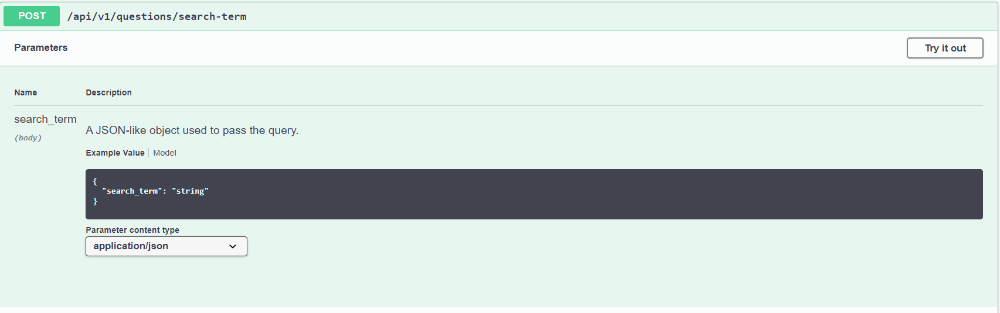
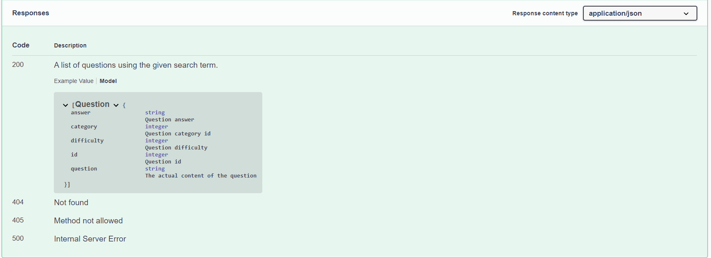
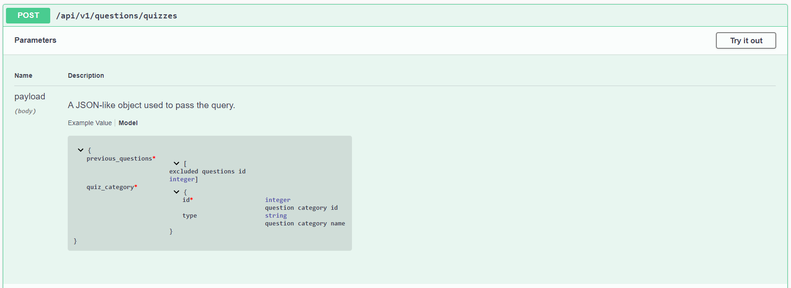
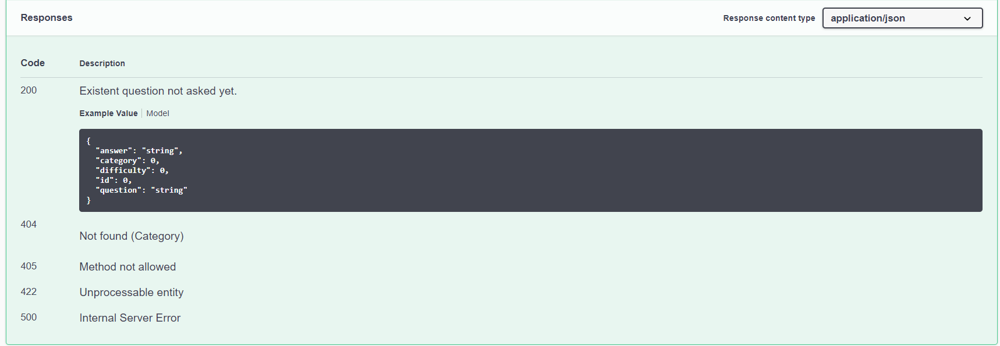

## Dear reviewer:

This project has been dockerized, after I went through the hell of dependency management.

### Quickstart using docker-compose (__recommended__)

* Make sure you have downloaded and installed docker in your local machine.
* Clone this repo and navigate to the root folder.
* Then Deploy services using docker-compose as follows : 
> $ docker-compose -f docker-compose up --build --remove-orphans
* Our project uses the postgres:12 base image to run and initialization script to automatically create and populate the trivia_test database. 
* The flaskr service (API) will be launched only if the database service is healthy. 
* Run unit tests : 
> $ source ./backend/run_tests.sh
* Test your knowledge of science, art, sports, history and entertainment with the Udacity Trivia Game App.
* Enjoy! 

 

### Installing dependencies locally
If you'd rather test locally (or cannot use docker) : 
* export the following environment variables:
> #!/bin/bash  
  export FLASK_APP=flaskr  
  export FLASK_ENV=development  
  export FLASK_LOCAL=true

> #On Powershell  
  $Env:FLASK_APP="flaskr"  
  $Env:FLASK_ENV="development"  
  $Env:FLASK_LOCAL=True

* Make sure to have an instance of postgresql up and running on localhost:5432.
* Initialize the database as follows : 
> createdb -U jorgepl -E UTF8 trivia_test  
  psql -f ./backend/scripts/trivia.psql trivia_test jorgepl

* Create a virtual environment and install python dependencies :
> #!/bin/bash
  python3 -m venv venv   
  source venv/bin/activate  
  pip install -r ./backend/requirements.txt  
  flask run

* You can then run the unit tests:
> python3 -m unittest discover ./backend/flaskr

* Finally, install node dependencies and initialize the frontend server as follows :
> cd frontend  
  npm i && npm start
  
   

## Read The Docs
* Take a look at the **documentation** by hitting the **/apidocs** endpoint of the flask/werkzeug server (__http://localhost:5000/apidocs__).
* Too lazy to open a new browser window? Keep reading.

### Categories

### Questions

### Using a search-term

### Fetching questions for quizzes

 

# Full Stack API Final Project

## Full Stack Trivia

Udacity is invested in creating bonding experiences for its employees and students. A bunch of team members got the idea to hold trivia on a regular basis and created a  webpage to manage the trivia app and play the game, but their API experience is limited and still needs to be built out. 

That's where you come in! Help them finish the trivia app so they can start holding trivia and seeing who's the most knowledgeable of the bunch. The application must:

1) Display questions - both all questions and by category. Questions should show the question, category and difficulty rating by default and can show/hide the answer. 
2) Delete questions.
3) Add questions and require that they include question and answer text.
4) Search for questions based on a text query string.
5) Play the quiz game, randomizing either all questions or within a specific category. 

Completing this trivia app will give you the ability to structure plan, implement, and test an API - skills essential for enabling your future applications to communicate with others. 

## Tasks

There are `TODO` comments throughout project. Start by reading the READMEs in:

1. [`./frontend/`](./frontend/README.md)
2. [`./backend/`](./backend/README.md)

We recommend following the instructions in those files in order. This order will look familiar from our prior work in the course.

## Starting and Submitting the Project

[Fork](https://help.github.com/en/articles/fork-a-repo) the [project repository]() and [Clone](https://help.github.com/en/articles/cloning-a-repository) your forked repository to your machine. Work on the project locally and make sure to push all your changes to the remote repository before submitting the link to your repository in the Classroom. 

## About the Stack

We started the full stack application for you. It is desiged with some key functional areas:

### Backend

The `./backend` directory contains a partially completed Flask and SQLAlchemy server. You will work primarily in app.py to define your endpoints and can reference models.py for DB and SQLAlchemy setup. 

### Frontend

The `./frontend` directory contains a complete React frontend to consume the data from the Flask server. You will need to update the endpoints after you define them in the backend. Those areas are marked with TODO and can be searched for expediency. 

Pay special attention to what data the frontend is expecting from each API response to help guide how you format your API. 

[View the README.md within ./frontend for more details.](./frontend/README.md)
